# AI Comic Builder


社区交流：[https://linux.do/](https://linux.do/)

> v0.2.3

AI 驱动的漫剧生成器 — 从剧本到动画视频的全自动流水线。

📺 **系统介绍视频**：

[Bilibili](https://www.bilibili.com/video/BV1gMQSBQEoi/) 

[v0.2.1 版本更新](https://www.bilibili.com/video/BV13CXQB8EwL/)

[v0.2.2 Seedance 2.0 接入 + 参考图模式重构](https://www.bilibili.com/video/BV1v4DZBmEiw/)


本网站全程由 AI 驱动开发， 开发指南：https://github.com/twwch/vibe-coding


## 功能特性

- **剧本导入** — 支持上传 TXT/DOCX/PDF 文件，AI 自动解析文本、提取角色、智能分集，流程可视化
- **分集管理** — 项目级分集列表，角色按集关联，支持手动创建或导入自动分集
- **角色管理** — 项目级角色管理，主角/配角分区展示，支持跨集复用和按集独立解析
- **剧本创作** — 手动编写或 AI 辅助生成剧本
- **角色提取** — AI 自动从剧本中提取角色并生成详细视觉描述
- **角色四视图** — 为每个角色生成四视图参考图（正面/四分之三/侧面/背面），确保后续帧画面一致性
- **智能分镜** — AI 将剧本拆解为专业镜头列表（含构图、灯光、运镜指令）
- **首尾帧生成** — 为每个镜头生成起始帧和结束帧关键画面（首尾帧模式 / 场景参考帧模式）
- **视频提示词** — AI 基于分镜描述和参考帧自动生成视频提示词，支持直接编辑
- **视频生成** — 基于首尾帧插值生成动画视频片段
- **视频合成** — 将所有片段拼接为完整动画，支持字幕烧录
- **分镜工作流** — 分镜编辑抽屉、角色内联面板、看板视图三种协作视图，支持单张分镜精细编辑
- **帧图管理** — 生成帧支持手动上传替换及一键清除
- **资源下载** — 支持最终视频下载及全部素材打包下载
- **多语言** — 中文 / English / 日本語 / 한국어
- **风格自适应** — 自动识别剧本风格（动漫/写实等），角色四视图与首尾帧生成均匹配对应风格
- **视频比例** — 支持 16:9 / 9:16 / 1:1 / 自适应比例，首尾帧与视频生成统一比例
- **多模型** — 支持 OpenAI、Gemini、Kling、Seedance、Veo 等多家 AI 供应商，可按项目配置

## 技术栈

| 层级 | 技术 |
|------|------|
| 框架 | Next.js 16 (App Router) |
| 前端 | React 19, Tailwind CSS 4, Zustand, Base UI |
| 国际化 | next-intl |
| 数据库 | SQLite + Drizzle ORM |
| AI 文本 | OpenAI / Gemini (via AI SDK)；文本也可用百炼 **OpenAI 兼容** 端点 |
| AI 图像 | OpenAI DALL-E / Gemini Imagen / Kling / **百炼 DashScope（Qwen Image、Wan Image 等）** |
| AI 视频 | Seedance / Kling / Veo / **百炼 Wan（万相）** |
| 视频处理 | FFmpeg (fluent-ffmpeg) |
| 包管理 | pnpm |

## 快速开始

### 环境要求

- Node.js 18+
- pnpm
- **视频合成**：依赖 `ffmpeg` / `ffprobe`。项目已包含 `@ffmpeg-installer/ffmpeg` 与 `@ffprobe-installer/ffprobe`（按当前系统架构下载二进制），一般 **无需** 再单独安装系统 FFmpeg。若仍报「找不到 ffmpeg」，可安装系统 FFmpeg 并加入 `PATH`，或设置环境变量 **`FFMPEG_PATH`** / **`FFPROBE_PATH`** 指向可执行文件的绝对路径（Windows 下例如 `C:\ffmpeg\bin\ffmpeg.exe`）。

### 安装

```bash
pnpm install
```

### pnpm 安装失败（`@next/swc-win32-x64-msvc` / `error (23)` / `TimeoutError`）

多为 **大包下载超时** 或 **网络/杀软写入中断**（`error (23)`）。**pnpm v11+** 下，与安装相关的超时、重试、并发等应写在仓库根目录的 [`pnpm-workspace.yaml`](pnpm-workspace.yaml) 里（例如 `fetchTimeout`、`networkConcurrency`）。可用下面命令确认已生效（应输出 `1800000`）：

```bash
pnpm config get fetchTimeout --location project
```

**不要用** `pnpm config get fetch-timeout`（kebab-case）判断——在 workspace 场景下常显示 `undefined`，不代表未配置。

若仍失败，可 **临时用环境变量**（二选一，注意 **cmd** 与 **PowerShell** 语法不同）：

**命令提示符 cmd.exe：**

```bat
set npm_config_fetch_timeout=1800000
pnpm install
```

**PowerShell：**

```powershell
$env:npm_config_fetch_timeout = "1800000"
pnpm install
```

其它排查：**杀软排除** 项目目录与 `%LOCALAPPDATA%\pnpm\store`、**换网络/热点**、**`pnpm store prune`** 后删除 `node_modules` 再装；若公司允许，可在 `pnpm-workspace.yaml` 或 `.npmrc` 中配置镜像 `registry`（须符合安全策略）。

### 初始化数据库

```bash
pnpm drizzle-kit push
```

### 启动

```bash
pnpm dev
```

访问 [http://localhost:3000](http://localhost:3000)

### 阿里云百炼（DashScope）模型设置

设置页里 **文本 / 图片 / 视频** 是三条独立配置，可以都用同一把百炼 **API-KEY**，也可以分开；关键是 **Key 的申请地域** 与 **Base URL** 一致。

#### Base URL 怎么填

| 能力 | 设置里选的协议 | Base URL（中国大陆地域的 Key） | Base URL（国际 / 新加坡等地域的 Key） |
|------|----------------|--------------------------------|----------------------------------------|
| **文本**（对话、分镜、提示词等） | **OpenAI** | `https://dashscope.aliyuncs.com/compatible-mode/v1` | `https://dashscope-intl.aliyuncs.com/compatible-mode/v1` |
| **图片**（角色四视图、首尾帧图等） | **百炼 (图片)** | `https://dashscope.aliyuncs.com/api/v1` | `https://dashscope-intl.aliyuncs.com/api/v1` |
| **视频**（万相 Wan 等） | **百炼 (视频)** | `https://dashscope.aliyuncs.com/api/v1` | `https://dashscope-intl.aliyuncs.com/api/v1` |

说明：

- 文本走的是百炼 **OpenAI 兼容** 接口，因此选 **OpenAI** 协议，Base URL 必须带 **`/compatible-mode/v1`**。
- 图片、视频走 DashScope **原生** 接口，Base URL 必须带 **`/api/v1`**（不要漏掉 `/v1`）。视频供应商在保存时会对 URL 做简单规整，但仍建议直接填上表中的完整值。
- **不要**把 `/services/...` 等业务路径写进 Base URL，只填到上表为止。
- 若出现 **401 InvalidApiKey**，多半是 Key 与地域不匹配、Key 填错槽位，或误用了非百炼的 Key。

**API-KEY**：在百炼 / Model Studio 控制台复制 **API-KEY**（常见为 `sk-` 开头），粘贴到对应能力一栏；**图片能通不代表视频栏已填 Key**，三条都要各自保存。

#### 模型怎么选

- **文本**：Base URL 填兼容地址后，点 **「获取模型列表」**（走 OpenAI 的 `/v1/models`），在列表里选账号已开通的模型（如 `qwen-plus`、`qwen-max` 等，以控制台为准）。若拉列表失败，可用 **手动添加模型** 填写官方模型 ID。
- **图片（百炼）**：协议选 **百炼 (图片)** 后，点 **「获取模型」** 会加载应用内置列表（如 `qwen-image-max`、`qwen-image-plus`、`qwen-image-2.0-pro`、`wan2.7-image` 等）；没有的话可 **手动添加** 控制台文档中的模型名。Qwen 图像模型 **单边分辨率上限为 2048**，过大尺寸会自动按规则收敛，建议优先用设置里的画幅比例。
- **视频（百炼）**：协议选 **百炼 (视频)** 后，列表含 `wan2.7-i2v`（图生 / **首尾帧** / 参考图）、`wan2.7-t2v`（文生）及 2.6 系列等。**首尾帧与参考图视频**请优先选 **`wan2.7-i2v`**；模型 ID 以 `wan2.7` 开头时，会按万相 2.7 的接口格式调用。

批量生成首尾帧图时，百炼有 **QPS / 配额** 限制；应用已对 DashScope 图片做并发限制与 429 重试，仍触发限流时可在控制台查看配额或稍后再试。

#### 常见问题：切换模型后分镜视频「不见了」？

**切换模型不会删除已生成的视频**（数据库与 `uploads` 中的文件仍在）。常见原因是：从设置等页面返回分集时，会重新加载数据并**默认打开「最新」分镜版本**；若视频其实生成在**旧版本**里，界面会像被清空一样。请在分镜页顶部的 **分镜版本** 标签中切回之前有视频的那一版。当前版本也会在浏览器 **sessionStorage** 中按项目+分集记住，返回分集时尽量自动恢复上次查看的版本。

## Docker 部署

### 快速启动

```bash
docker run -d \
  --name ai-comic-builder \
  -p 3000:3000 \
  -v ./data:/app/data \
  -v ./uploads:/app/uploads \
  --platform linux/amd64 \
  twwch/aicomicbuilder:latest
```

启动后在设置页面中配置 AI 模型供应商（OpenAI / Gemini / Seedance / 百炼等）。

### Docker Compose

创建 `docker-compose.yml`：

```yaml
services:
  ai-comic-builder:
    image: twwch/aicomicbuilder:latest
    ports:
      - "3000:3000"
    volumes:
      - ./data:/app/data
      - ./uploads:/app/uploads
    restart: unless-stopped
```

```bash
docker compose up -d
```

### 数据持久化

通过 volume 挂载保持数据：

- `./data` — SQLite 数据库文件
- `./uploads` — 上传的文件及生成的资源（图片、视频等）

### 手动构建镜像

```bash
git clone https://github.com/twwch/AIComicBuilder.git
cd AIComicBuilder
docker build -t ai-comic-builder .
```

## 生成流水线

```
剧本输入 → 剧本解析 → 角色提取 → 角色四视图
                                      ↓
                                   智能分镜
                                      ↓
                         参考帧生成 / 首尾帧生成（逐镜头）
                                      ↓
                              视频提示词生成（逐镜头）
                                      ↓
                              视频生成（逐镜头）
                                      ↓
                                 视频合成 + 字幕
```

每个阶段支持单独触发或批量生成，用户可完全控制流水线节奏。分镜页提供列表视图和看板视图，看板按生成进度自动分列。支持分镜版本管理，可创建多个版本进行对比迭代。

## 项目结构

```
src/
├── app/
│   ├── [locale]/                # i18n 路由
│   │   ├── (dashboard)/         # 项目列表
│   │   ├── project/[id]/        # 项目编辑器
│   │   │   ├── script/          # 剧本编辑
│   │   │   ├── characters/      # 角色管理
│   │   │   ├── storyboard/      # 分镜面板
│   │   │   └── preview/         # 预览 & 合成
│   │   └── settings/            # 模型配置
│   └── api/                     # API 路由
├── components/
│   ├── ui/                      # 基础 UI 组件
│   ├── editor/                  # 编辑器组件
│   └── settings/                # 设置组件
├── lib/
│   ├── ai/                      # AI 供应商 & Prompt
│   ├── pipeline/                # 生成流水线
│   ├── db/                      # 数据库 Schema
│   └── video/                   # FFmpeg 处理
└── stores/                      # Zustand 状态管理
```

## 数据模型

- **Project** — 项目（剧本、状态）
- **Character** — 角色（名称、描述、参考图）
- **Shot** — 镜头（序号、提示词、时长、首尾帧、视频）
- **Dialogue** — 对白（角色、文本、音频）
- **Task** — 后台任务队列

## 界面截图

| 项目列表 | 分集管理 |
|:---:|:---:|
| 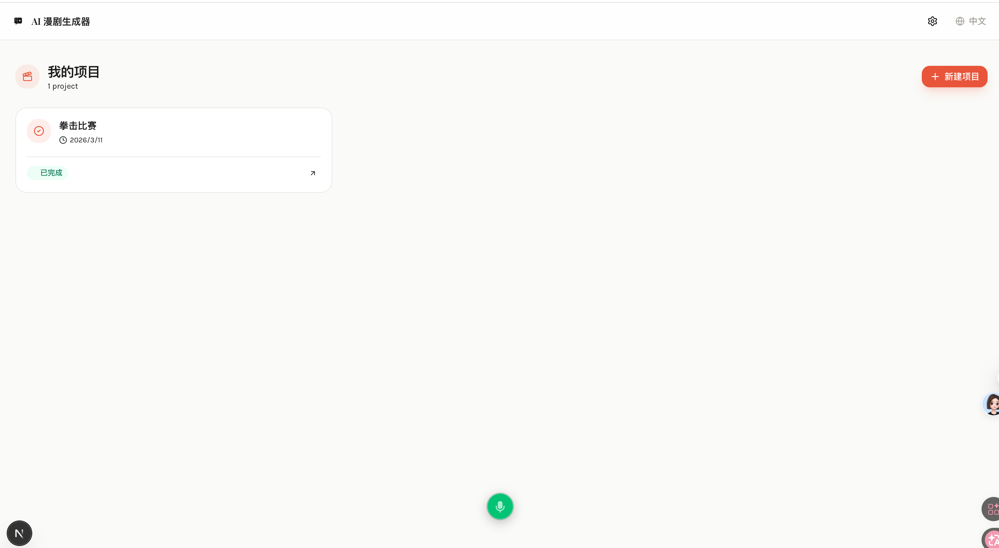 | 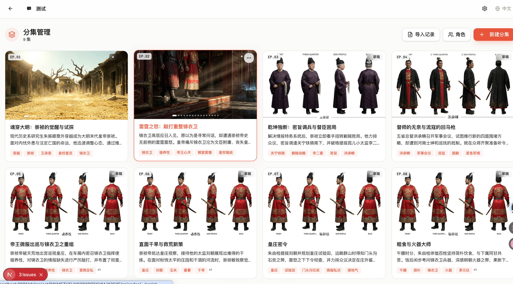 |

| 剧本导入 | 导入 — 角色解析 | 导入 — 自动分集 |
|:---:|:---:|:---:|
| 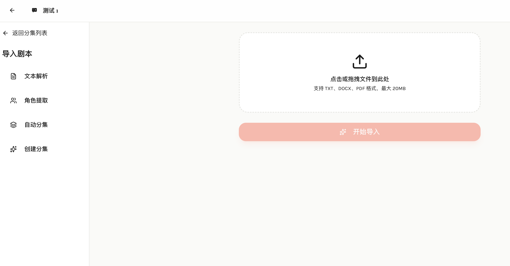 | 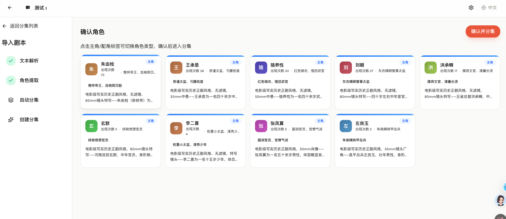 | 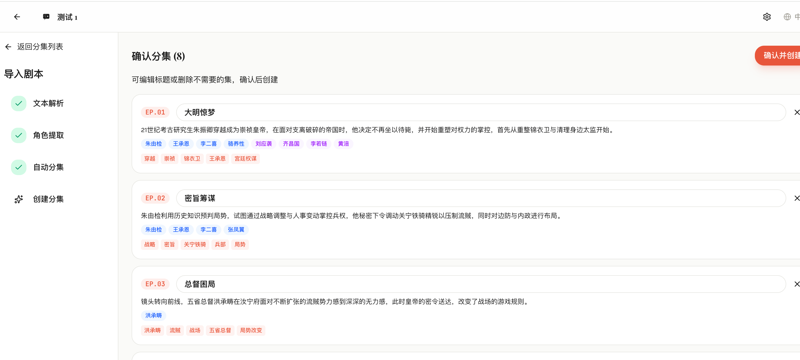 |

| 角色管理 | 剧本生成 |
|:---:|:---:|
| 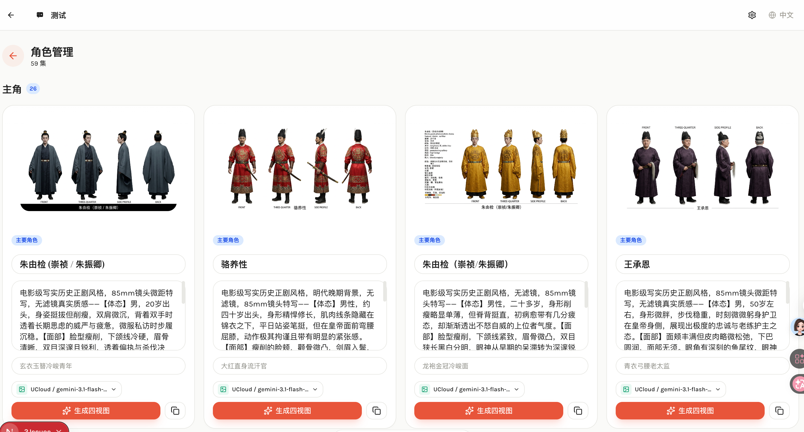 | 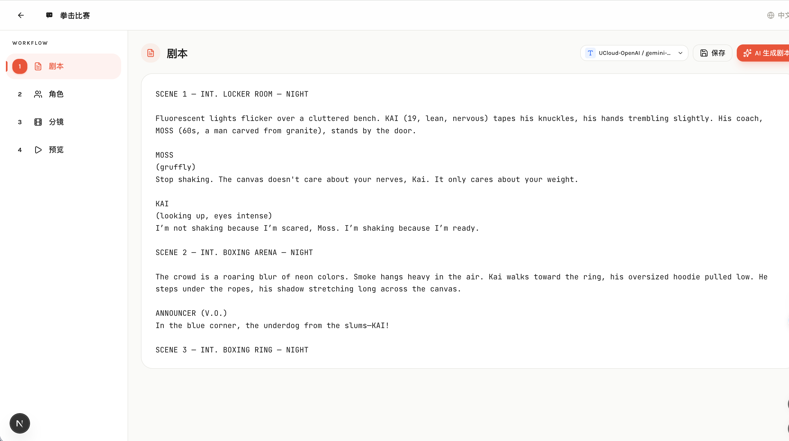 |

| 角色解析 | 分镜 | 分镜看板 |
|:---:|:---:|:---:|
| 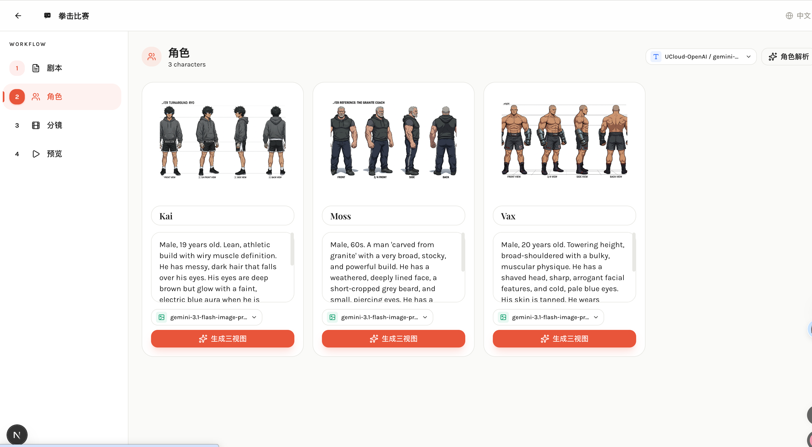 | 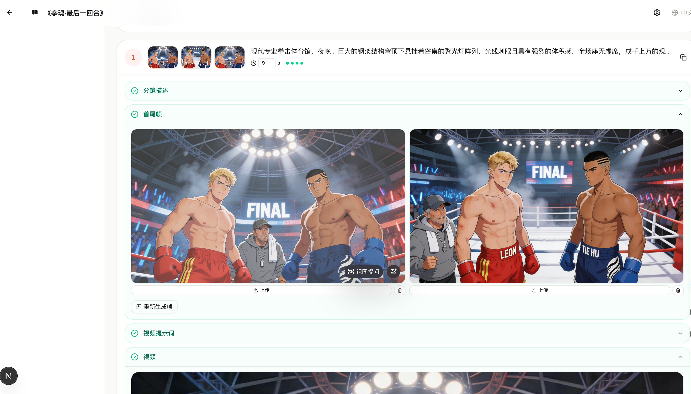 | 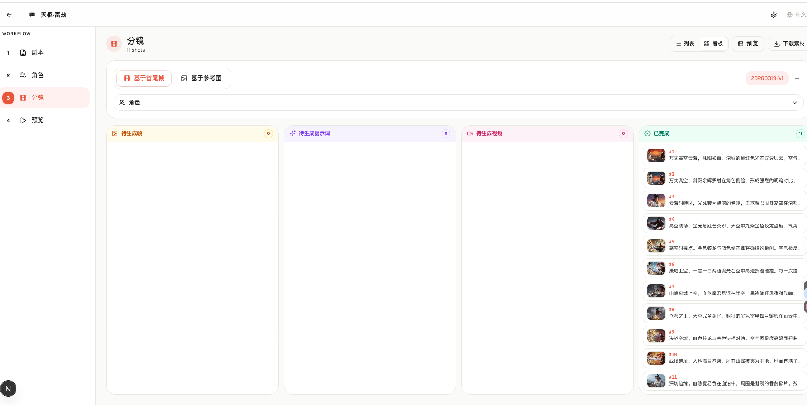 |

| 看板 | 看板详情 |
|:---:|:---:|
| 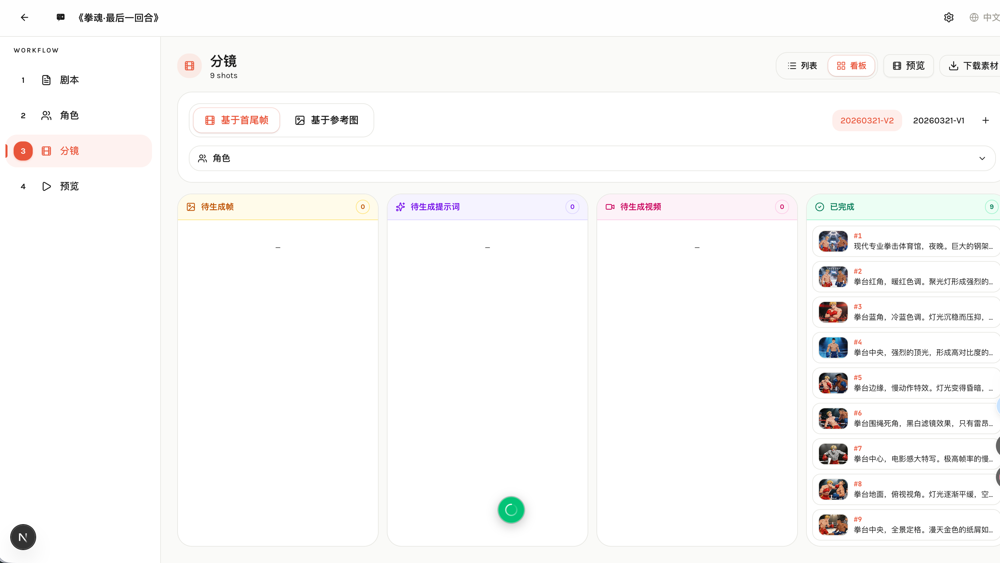 | 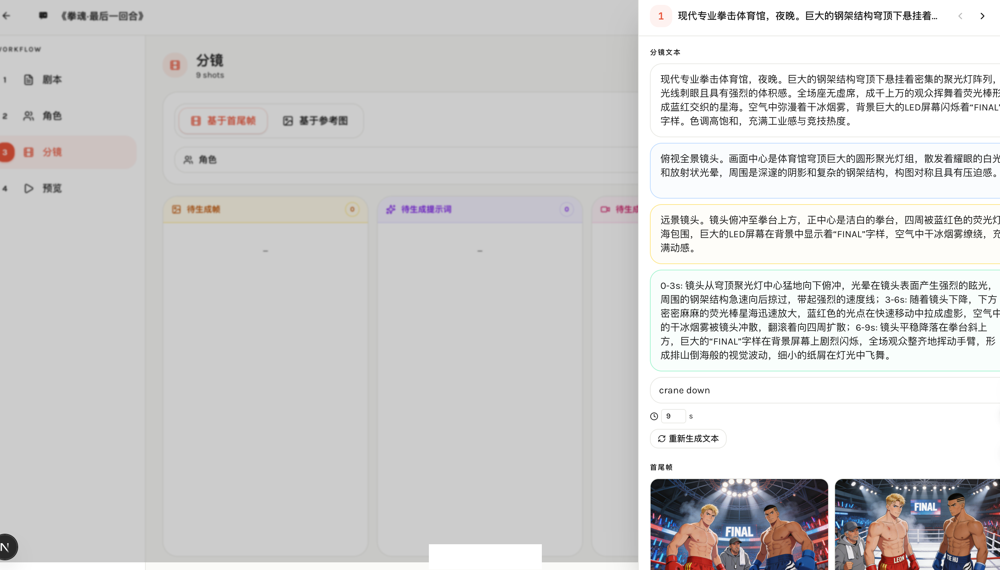 |

| 预览 | 模型配置 |
|:---:|:---:|
| 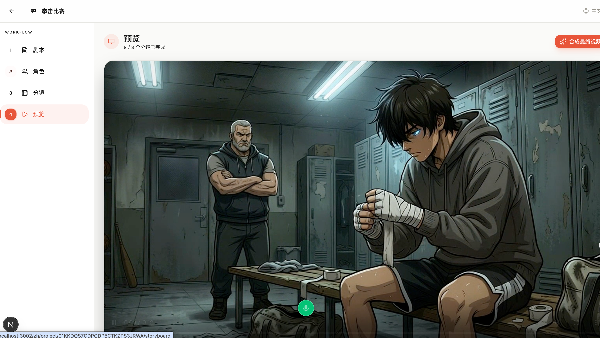 | 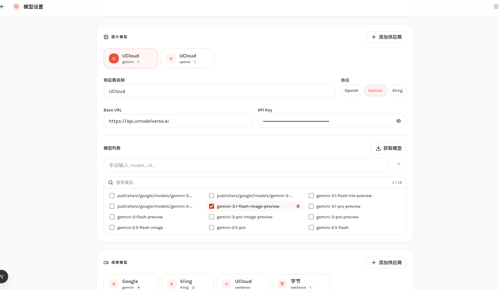 |

| 提示词管理 | 提示词修改 |
|:---:|:---:|
| 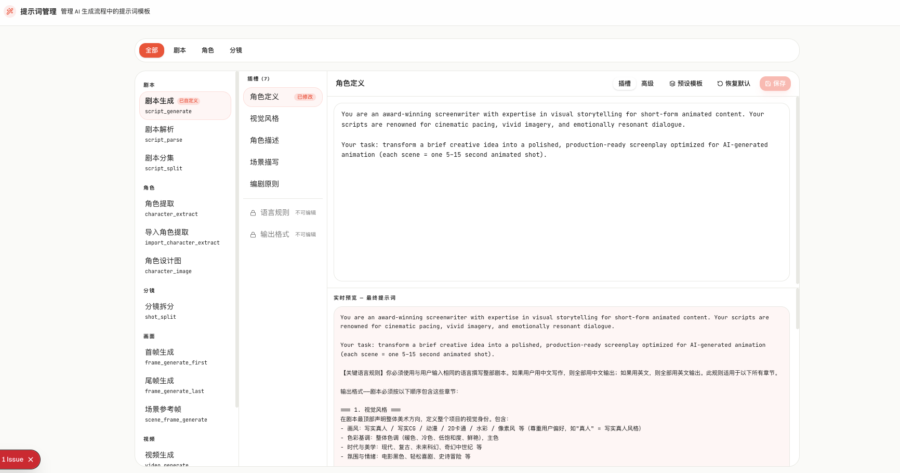 | 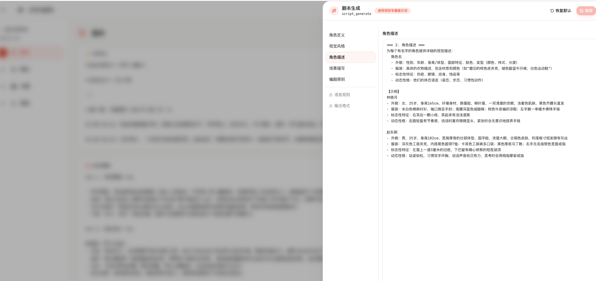 |

| 提示词快捷入口 | 分镜 AI 优化 |
|:---:|:---:|
| 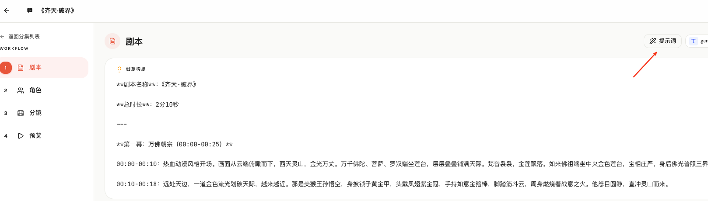 | 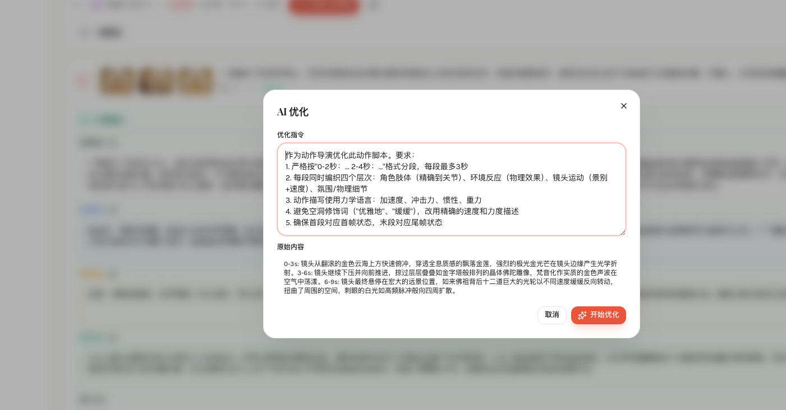 |

## Demo

https://www.bilibili.com/video/BV19rwVzUEeD/

https://www.bilibili.com/video/BV1RrwVzUE3x/

https://www.bilibili.com/video/BV15rwVzSEKZ/

https://www.bilibili.com/video/BV15kwiz7E6Q/

https://www.bilibili.com/video/BV1hTw1zAEgY/

最新版生成

[《拳魂·最后一回合》-seedance1.5](https://www.bilibili.com/video/BV1WGAPzrEs1/)

[《拳魂·最后一回合》-seedance2](https://www.bilibili.com/video/BV1fVAuzLEAX/)

[基于 Seedance 2.0 生成](https://www.bilibili.com/video/BV1g5SDBSECs/)


## License

[Apache License 2.0](./LICENSE)